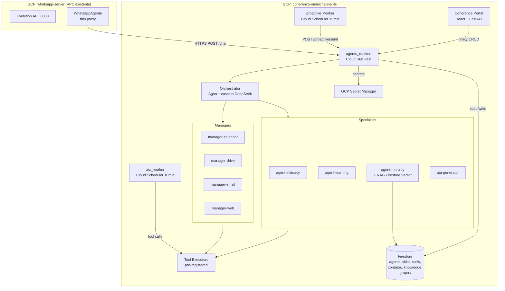
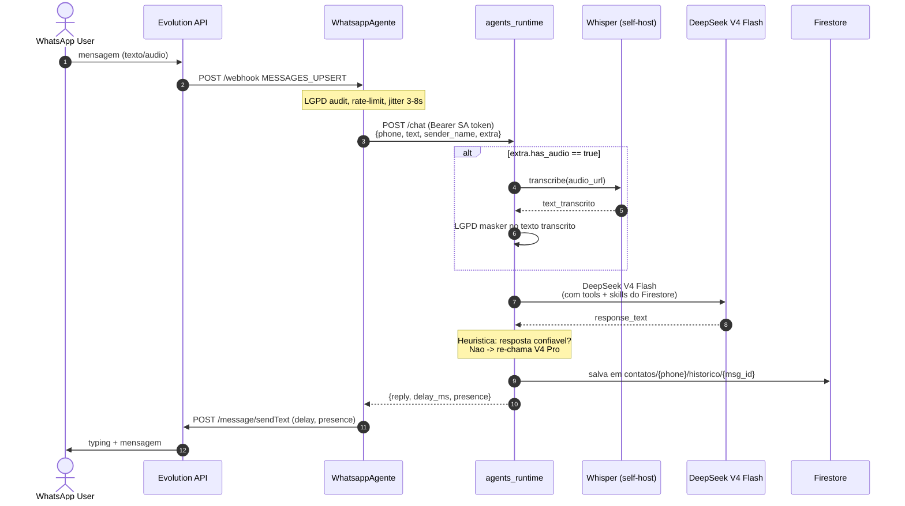
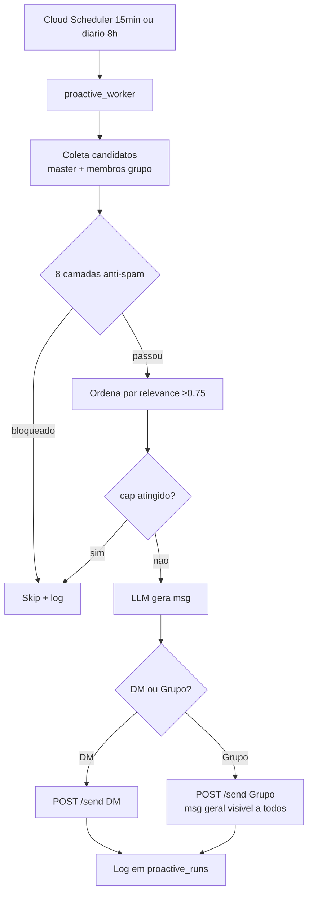

# Arquitetura do Projeto — ChatBotWhatsapp

> **Objetivo Principal:** Modulo `omnichannel-agentes` no Coherence Portal + servico `agents_runtime` (Cloud Run) com Jennifer (assistente corporativa) + 4 Managers + 3 Specialists, com hot-reload via Firestore.

> **Documento mestre:** [`PLAN_OMNICHANNEL_AGENTES.md`](./PLAN_OMNICHANNEL_AGENTES.md) — plano consolidado completo.

## Stack Tecnologico

| Camada | Tecnologia |
|---|---|
| Linguagem | Python 3.12 |
| Web framework | FastAPI + Uvicorn |
| LLM framework | Agno |
| LLM primario | DeepSeek V4 Flash (cascata: NVIDIA NIM → MiniMax M3) |
| LLM escalacao | DeepSeek V4 Pro (via heuristica) |
| Embeddings RAG | MiniMax embo-01 (1536d) via `langchain_community.embeddings.MiniMaxEmbeddings` |
| Vector DB | Firestore Vector (collection `agente-knowledge-{phone}`) |
| Datastore | Firestore (coherence-ominichannel-fs) |
| Secrets | GCP Secret Manager (upload via `versions add` apenas) |
| Audio STT | faster-whisper base CPU int8 (self-host, background load) |
| Web search | Serper.dev (com cache 24h) |
| Deploy | Cloud Run `agents-runtime-test` (region us-central1) |
| CI/CD | Cloud Build (push em `test` → deploy automatico) |
| Frontend (UI do modulo) | Coherence Portal React + FastAPI proxy |

## Componentes Principais

1. **agents_runtime** (Cloud Run) — Orquestrador + tools + specialists
2. **Coherence Portal** (existente) — UI de gestao `/admin/agents/*`
3. **WhatsappAgente** (existente, edicao minima) — Thin proxy Evolution API
4. **ata_worker** (Cloud Run Job) — Geracao de atas pos-reuniao
5. **proactive_worker** (Cloud Run Job) — Mensagens proativas (calibrado, 2/dia max)

## Fluxo de Dados Principal



## Fluxo de Mensagem WhatsApp (texto + audio)



## Estrutura de Dados e Persistencia

### Firestore Collections (project `coherence-ominichannel-fs`)

| Collection | Funcao | Chave | Acesso |
|---|---|---|---|
| `usuarios/{phone}` | Dados pessoais + OAuth token individual | phone (E.164) | So o dono |
| `contatos/{phone}` | Memoria por contato | phone (E.164) | So o dono |
| `contatos/{phone}/historico/{msg_id}` | Mensagens individuais (TTL 90d) | msg_id | So o dono |
| `contatos/{phone}/corrections/{id}` | Log de correcoes aplicadas | correction_id | So o dono |
| `apelidos_custom/{phone}` | Apelidos aprendidos por contato | phone | So o dono |
| `agente-Knowledge-{phone}/{doc_id}` | Conhecimento privado vetorial (1536d) | doc_id | So o dono |
| `public-Knowledge-Shared/{doc_id}` | Conhecimento publico vetorial (1536d) | doc_id | Todos |
| `group-Knowledge-{grupo}/{doc_id}` | Conhecimento de grupo vetorial (1536d) | doc_id | Membros |
| `agents/{id}` | Definicoes de agentes | agent_id | Admin |
| `skills/{id}` | Skills markdown reutilizaveis | skill_id | Admin |
| `tools/{id}` | Tools pre-registradas com schema | tool_id | Admin |
| `grupos/{group_jid}` | Grupos onde Jennifer participa | group_jid | Admin |
| `grupos/{group_jid}/membros/{phone}` | Membros de cada grupo | phone | Admin |
| `ata_runs/{id}` | Log de geracao de atas | run_id | Admin |
| `proactive_runs/{id}` | Log de proatividade | run_id | Admin |
| `proactive_feedback/{id}` | Engagement de msgs proativas | feedback_id | Admin |
| `proactive_weekly/{YYYY-WW}` | Avaliacao semanal | week_id | Admin |
| `audit/{id}` | LGPD audit log (5y retention) | audit_id | Admin |
| `cost_runs/{month}` | Metricas de custo LLM | YYYY-MM |
| `modules/{id}` | Registro de modulos (existente Portal) | module_id |

## Hierarquia de Agentes

```
jennifier (orchestrator)
    ├── 4 Domain Managers
    │   ├── manager-calendar (V4 Flash)
    │   ├── manager-drive (V4 Flash)
    │   ├── manager-email (V4 Flash)
    │   └── manager-web (V4 Flash)
    └── 4 Specialists
        ├── agent-intimacy (V4 Flash) - apelidos, rapport
        ├── agent-learning (V4 Pro) - auto-aprendizado com confirmacao
        ├── agent-morality (V4 Flash) - filtros + RAG juridico
        └── ata-generator (V4 Pro + thinking) - pos-reuniao
```

## Topologia Cloud Run (TEST)

| Servico | CPU | Mem | min/max | Auth |
|---|---|---|---|---|
| `agents-runtime-test` | 2 | **2Gi** | **0/3** | Bearer SA (exceto /healthz) + ping 5min |
| `coherence-portal-test` | 2 | 2Gi | 0/2 | Firebase JWT |
| `whatsapp-agente-test` | 1 | 1Gi | **0/2** | Bearer SA + Evolution webhook + ping 5min |

**Cold start strategy:** ambos servicos com `min-instances=0`. Ping via Cloud Scheduler a cada 5min para manter warm durante horario comercial. Cold start tipico: 5-15s em horario nao-comercial (0h-7h).

## Fluxo de Proatividade



## Referencias

- [PLAN_OMNICHANNEL_AGENTES.md](./PLAN_OMNICHANNEL_AGENTES.md) - Plano completo
- [HARNESS.md](./HARNESS.md) - Setup e deploy
- [GUARDRAILS.md](./GUARDRAILS.md) - Regras inegociaveis
- [DIARIO_BORDO.md](./DIARIO_BORDO.md) - Historico de decisoes
- `Coherence_Portal/docs/MODULE_INTEGRATION_AGENTES.md` - Contrato Portal ↔ agents_runtime