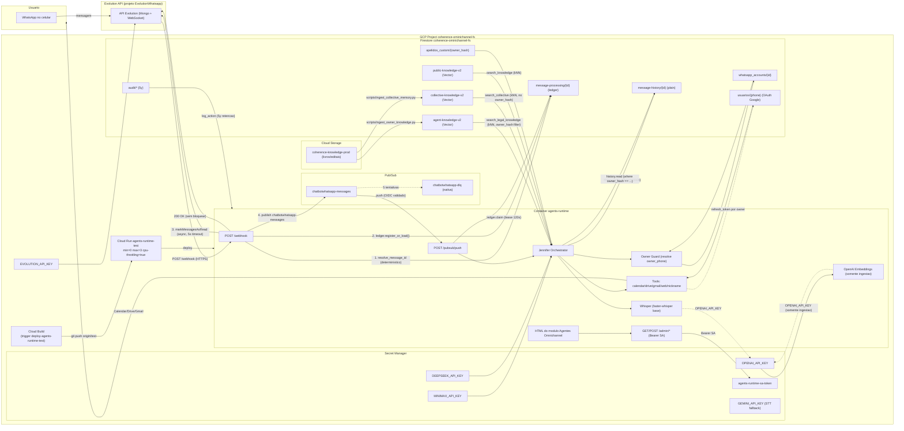
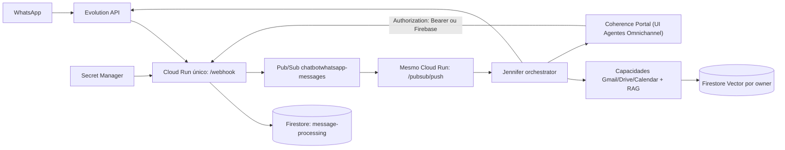
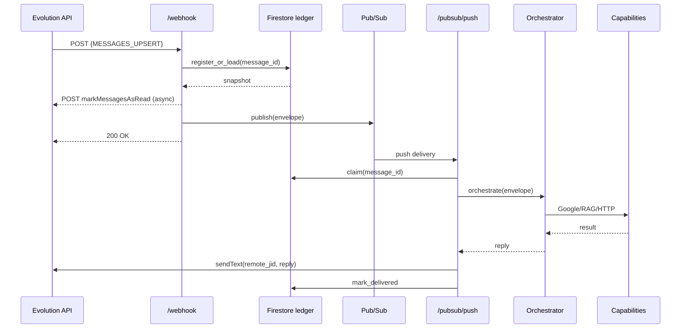

# Arquitetura — ChatBotWhatsapp (Agentes Omnichannel)

> Última revisão: **2026-07-23** — diagrama visual completo do caminho
> ponta-a-ponta (WhatsApp → resposta) com Firestore plain para
> histórico de chat e Firestore Vector restrito a documentos.
> Ver `docs/DIARIO_BORDO.md` para o histórico completo do dia.

## 0. Diagrama visual (ponta a ponta)



### 0.1. Caminho do webhook em sequência (numerada no diagrama)

| Passo | Onde | O que acontece |
| --- | --- | --- |
| 1 | `webhook` | Resolve `message_id` determinístico (ou usa o do Evolution). |
| 2 | `webhook` | `ledger.register_or_load` — idempotência transacional no Firestore. |
| 3 | `webhook` | `markMessagesAsRead` na Evolution v2 (timeout 5 s, async — não bloqueia o webhook). |
| 4 | `webhook` | Publica em `chatbotwhatsapp-messages` e devolve `200 OK` imediatamente. |
| 5 | `push` | `ledger.claim` — pega lease de 120 s. |
| 6 | `orchestrator` | Detecta intenção, escolhe agente principal, prefetch Calendar/Email/Drive. |
| 7 | `tools` | Owner Guard valida que o telefone é o `owner_phone` da conta antes de chamar Gmail/Drive/Calendar. |
| 8 | `orchestrator` | Persistência plain (`message-history/{id}`) com `owner_hash` derivado. |
| 9 | `orchestrator` | Cascata LLM (MiniMax M2.7 → M3 → DeepSeek V4 Flash) com mascaramento PII. |
| 10 | `pubsub` | `send_text` na Evolution → resposta + tick azul. |
| 11 | `pubsub` | `mark_delivered` no ledger. |

### 0.2. Mapa de Firestore

```
coherence-ominichannel-fs
├── agents/                      # configuracao (Carregada pelo agent_loader)
├── skills/
├── tools/
├── config/
├── whatsapp_accounts/{id}/      # 1 doc por instancia Evolution
├── usuarios/{phone}/            # OAuth Google do proprietario
├── apelidos_custom/{owner_hash}
├── audit/                        # 5 anos de retencao
├── message-processing/{id}/      # ledger Pub/Sub (TTL 7 dias)
├── message-history/{id}/         # historico de chat (FIRESTORE PLAIN)
└── *-knowledge-v2/              # Firestore Vector SOMENTE para docs
    ├── agent-knowledge-v2/
    ├── collective-knowledge-v2/
    └── public-knowledge-v2/
```

## 1. Objetivo

Um único runtime FastAPI (`agents-runtime`) responde a mensagens do
WhatsApp via Evolution API, orquestra capacidades por agente
(configuração em Firestore), consulta Gmail/Drive/Calendar
**somente para o proprietário da conta Evolution** e mantém uma base
vetorial privada por proprietário em Firestore Vector. A documentação
oficial é **somente esta pasta `docs/` na raiz**; cópias em
`agents_runtime/docs/` foram removidas em 22/07/2026.

## 2. Stack

- **Linguagem**: Python 3.12 (imagem `python:3.12-slim`).
- **Framework**: FastAPI 0.115 + Uvicorn.
- **Mensageria**: Pub/Sub (`chatbotwhatsapp-messages` + DLQ nativa
  `chatbotwhatsapp-dlq`).
- **Persistência**: Firestore (collections canônicas acima) + GCS para
  arquivos-fonte da base de conhecimento.
- **Embeddings**: OpenAI `text-embedding-3-small` (1536d), coleção
  `*-v2`.
- **LLM**: cascata MiniMax M2.7 Highspeed → MiniMax M3 → DeepSeek V4
  Flash.
- **STT**: Whisper local (`faster-whisper`, `base/int8`). Fallback
  controlado para Gemini 2.5 Flash apenas em falha técnica do Whisper
  **e** com consentimento explícito.
- **TTS / tick azul**: `markMessagesAsRead` (Evolution v2) automático
  em cada webhook válido.
- **Segredos**: Google Secret Manager, projeto
  `coherence-ominichannel-fs`.

## 3. Topologia



## 4. Componentes

| Componente | Responsabilidade |
| --- | --- |
| `main.py` | FastAPI, lifecycle, endpoints `/webhook`, `/pubsub/push`, `/chat`, `/admin/*`. |
| `orchestrator.py` | Detecção de intenção, roteamento para capabilities, prefetch Calendar/Email/Drive, indexação RAG. |
| `agent_loader.py` | Polling 120 s para `agents`, `skills`, `tools` e snapshot atômico. |
| `core.message_ledger` | Ledger Firestore para idempotência transacional de mensagens. |
| `core.pubsub_dispatcher` | Lease, retry-control e terminalidade por mensagem. |
| `core.evolution_client` | `send_text` e `mark_messages_read` na Evolution v2. |
| `core.audio_transcribe` | Wrapper Whisper com fallback controlado para Gemini 2.5 Flash. |
| `core.owner` + `core.owner_guard` | Resolução do proprietário da instância Evolution e aplicação do guard em Gmail/Drive/Calendar. |
| `tools/google_*` | Integrações Google com escopos mínimos e guard do proprietário. |
| `core.rag` | Embeddings OpenAI e busca vetorial filtrada por `owner_hash`. |
| `core.module_ui` | Plano de controle HTML renderizado em `/admin/dashboard`. |
| `scripts/ingest_owner_knowledge.py` | Ingestão de livros/editais em GCS para a coleção do proprietário. |

## 5. Fluxo da mensagem



A entrega da resposta é registrada no ledger; Pub/Sub só reentrega se a
instância sinaliza 503 (falha transitória). Falhas terminais são marcadas e o
Pub/Sub descarta após o número configurado de tentativas.

## 6. Coleções Firestore

Camadas:

### Mensageria e controle
- `message-processing/{message_id}` — ledger de idempotência por mensagem (TTL 7 dias).
- `audit/*` — trilha de auditoria.
- `whatsapp_accounts/{account_id}` — vínculo entre `instance`, `owner_phone`, `owner_uid`.
- `usuarios/{phone}` — tokens OAuth Google do proprietário (refresh automático).

### Histórico do chat (Firestore **plain**, sem embedding)
- `message-history/{history_id}` — todas as interações (`owner_hash` +
  `message_id` + `text_masked` + `conversation_id` + `direction` +
  `created_at` + `agent_id`). Filename explícito: conversas **nunca** vão
  para o Firestore Vector. A coleção `conversation-memory-v2` (vetorial)
  está marcada como **legada** e não é mais alimentada pelo runtime.

### Base de conhecimento (Firestore Vector, embeddings OpenAI)
- `agent-knowledge-v2` — livros/editais por proprietário (`owner_hash`).
- `collective-knowledge-v2` — memórias coletivas configuradas pelo
  operador via `scripts/ingest_collective_memory.py`.
- `public-knowledge-v2` — base pública sem `owner_hash`.

### Configuração carregada pelo `agent_loader`
- `agents`, `skills`, `tools`, `config/*`.
- `apelidos_custom/{owner_hash}` — consentimento de apelidos.

Regras de isolamento:

- Toda leitura vetorial (`agent-knowledge-v2`, `collective-knowledge-v2`)
  filtra `owner_hash == owner_hash(inbound)`. A coleção pública não
  recebe `owner_hash`.
- Toda leitura em `message-history` filtra
  `where("owner_hash", "==", _owner_hash(phone))` antes de ordenar por
  `created_at` desc.
- Quando o `phone` chega vazio (caso de grupo sem sender identificável),
  a interação é **ignorada** com `status: skipped, reason: missing_phone`
  para evitar mistura entre contas.
- Gmail/Drive/Calendar requerem que o telefone do remetente coincida com o
  `owner_phone` da conta Evolution; tool retorna
  `owner_only_capability` caso contrário.

## 7. Módulo `Agentes Omnichannel` (plano de controle)

Continua dentro do `agents-runtime` em `/admin/dashboard`. Agora:

- Não depende mais de tokens em query string. Aceita `Authorization: Bearer`
  ou Firebase ID token; o bearer é refletido na página apenas para evitar que
  o frontend fique sem credencial em interações locais.
- Mantém abas: **Contas WhatsApp**, **Agentes**, **Skills**, **Tools**,
  **Proprietários**, **Conhecimento**, **Status**.
- Tools são somente leitura no Firestore — a implementação executável continua
  versionada em código.

## 8. Áudio

- Whisper local em `tools/audio_transcribe.py`. Warm-up assíncrono no startup.
- Download valida host, MIME, tamanho (25 MB), duração (5 min) e ausência de
  redirecionamento.
- Em falha técnica (`RuntimeError`, `MemoryError`, timeout) o `core/audio_transcribe`
  aciona o fallback Gemini 2.5 Flash **apenas** se houver consentimento
  registrado (`STT_FALLBACK_CONSENT=true` ou `audio_consent_external=true`).
- Limite diário: 20 chamadas (configurável via `STT_FALLBACK_DAILY_LIMIT`).
- Áudio bruto nunca é persistido; arquivos temporários são apagados em
  `finally` e a transcrição é mascarada antes de chegar ao LLM ou ao vetor.

## 9. Custos e limites

- Cascade LLM com MiniMax M2.7 Highspeed como entrada minimiza tokens.
- Limite diário de fallback Gemini (20/dia) impede surpresas de billing.
- Pub/Sub: idempotência garantida pelo ledger evita a antiga tempestade de 44k
  requisições/dia.
- Firestore Vector: retém coleções por 90 dias (`RETENTION_DAYS`).

## 10. Conformidade

- LGPD: `scripts/check_lgpd_compliance.py` roda no CI e valida `LGPD.md`,
  `TERMOS.md`, snippets obrigatórios, Dockerfile.
- Tokens OAuth são persistidos sem `client_secret` no documento (strip no
  `oauth_per_user._persist_token`).
- Auditoria registra `actor`, `action`, `target`, `phone_hash` (truncado).
- Retenção de logs 5 anos (LGPD Art. 37).

## 11. Pendências conhecidas

- Migração completa do proxy `WhatsappAgente` para descarte precisa de janela
  com `agents-runtime-prod` pausado.
- RAG por owner precisa de script de migração para backfill de embeddings já
  gerados sob o antigo `_owner_hash(phone)`.
- README em `agents_runtime/README.md` ainda menciona contagens antigas; será
  atualizado após o deploy.