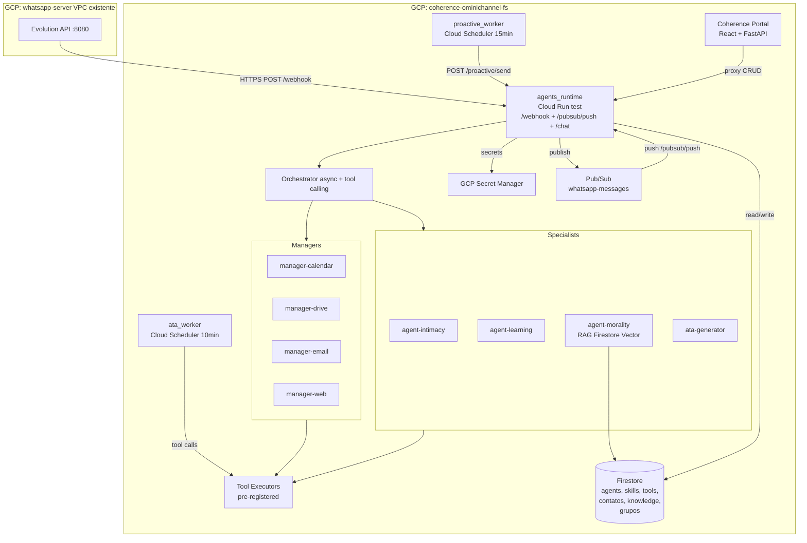
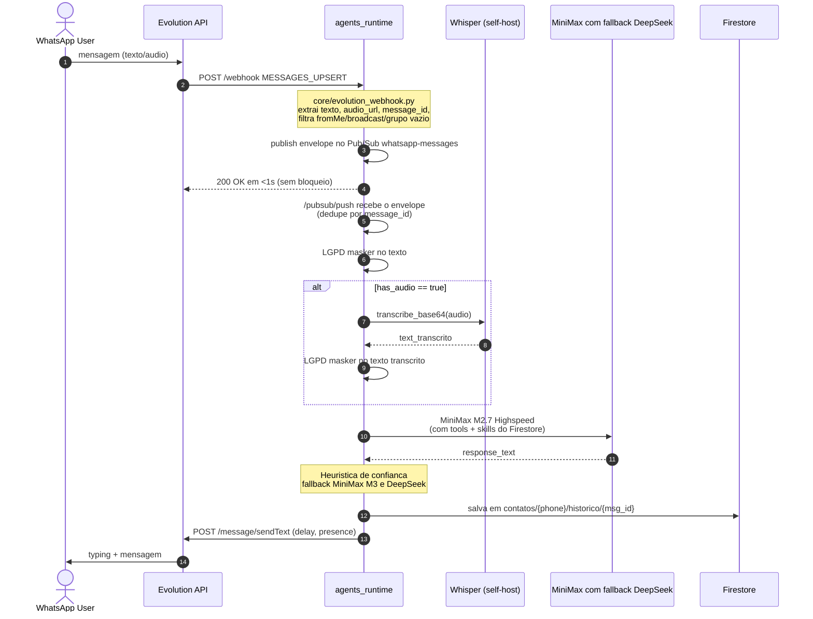
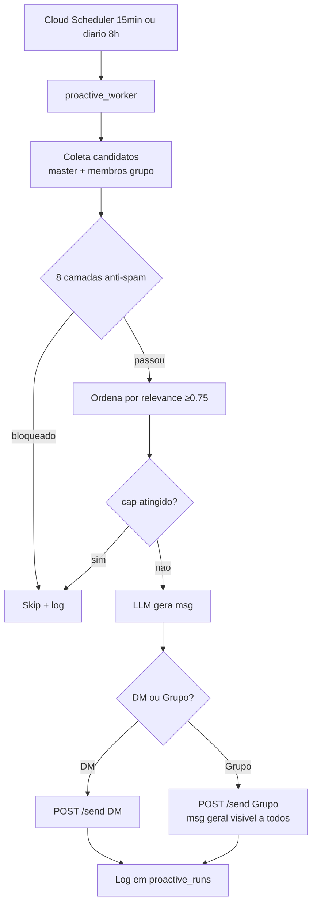

# Arquitetura do Projeto — ChatBotWhatsapp

> **Objetivo Principal:** Modulo `omnichannel-agentes` no Coherence Portal + servico `agents_runtime` (Cloud Run) com Jennifer (assistente corporativa) + 4 Managers + 3 Specialists, com hot-reload via Firestore.

> **Documento mestre:** [`PLAN_OMNICHANNEL_AGENTES.md`](./PLAN_OMNICHANNEL_AGENTES.md) — plano consolidado completo.

## Stack Tecnologico

| Camada | Tecnologia |
|---|---|
| Linguagem | Python 3.12 |
| Web framework | FastAPI + Uvicorn |
| LLM framework | Orquestrador Python async com tool calling |
| LLM primario | MiniMax M2.7 Highspeed |
| LLM fallback | MiniMax M3 → DeepSeek V4 Flash |
| OAuth por usuario | `core/oauth_per_user.py` (Fase C 2026-07-21) com HMAC state, refresh automatico e persistencia em `usuarios/{phone}/google_oauth_token`. `phone` e obrigatorio nos 3 managers (Fase D 2026-07-21); secret global `GOOGLE_OAUTH_TOKEN` removido |
| Cliente Evolution | `core/evolution_client.py` (Fase C 2026-07-21) — fonte canonica de envio de mensagens WhatsApp |
| Logs estruturados | `core/logging.py:JsonFormatter` (Fase C 2026-07-21) — JSON com timestamp BRT em milissegundos |
| Compliance LGPD | `scripts/check_lgpd_compliance.py` (Fase C 2026-07-21) — gate local de arquivos obrigatorios e snippets canonicos |
| Embeddings RAG | OpenAI text-embedding-3-small (1536d), sem fallback entre dimensoes |
| Vector DB | Firestore Vector v2 (`conversation-memory-v2`, `agent-knowledge-v2`, `public-knowledge-v2`) |
| Datastore | Firestore (coherence-ominichannel-fs) |
| Secrets | GCP Secret Manager (upload via `versions add` apenas) |
| Audio STT | faster-whisper base CPU int8 (self-host, background load) |
| Web search | Serper.dev (com cache 24h) |
| Deploy | Cloud Run `agents-runtime-test` (region us-central1) |
| CI/CD | Cloud Build (push em `test` → deploy automatico) |
| Frontend (UI do modulo) | Coherence Portal React + FastAPI proxy |

## Componentes Principais

1. **agents_runtime** (Cloud Run) — Orquestrador + tools + specialists + webhook Evolution + publisher Pub/Sub
2. **Coherence Portal** (existente) — UI de gestao `/admin/agents/*`
3. **ata_worker** (Cloud Run Job) — Geracao de atas pos-reuniao
4. **proactive_worker** (Cloud Run Job) — Mensagens proativas (calibrado, 2/dia max)

> **Removido 2026-07-21 (Fase A):** `WhatsappAgente` thin proxy. O webhook Evolution
> foi consolidado em `agents_runtime/main.py` rota `/webhook`. O extrator canonico
> vive em `core/evolution_webhook.py` e cobre texto, audioMessage, extendedTextMessage,
> grupo, broadcast e fromMe.

## Fluxo de Dados Principal



## Fluxo de Mensagem WhatsApp (texto + audio)



## Estrutura de Dados e Persistencia

### Firestore Collections (project `coherence-ominichannel-fs`)

| Collection | Funcao | Chave | Acesso |
|---|---|---|---|
| `usuarios/{phone}` | Dados pessoais + OAuth token individual | phone (E.164) | So o dono |
| `contatos/{phone}` | Memoria por contato | phone (E.164) | So o dono |
| `contatos/{phone}/historico/{msg_id}` | Mensagens individuais (TTL 90d) | msg_id | So o dono |
| `contatos/{phone}/corrections/{id}` | Log de correcoes aplicadas | correction_id | So o dono |
| `apelidos_custom/{phone}` | Apelidos aprendidos por contato | phone | So o dono |
| `conversation-memory-v2/{doc_id}` | Memoria vetorial mascarada, TTL 90d | owner_hash + message_id | So o dono |
| `agent-knowledge-v2/{doc_id}` | Conhecimento privado vetorial (1536d) | owner_hash + doc_id | So o dono |
| `public-knowledge-v2/{doc_id}` | Conhecimento publico vetorial (1536d) | doc_id | Todos |
| `group-knowledge-v2/{doc_id}` | Conhecimento de grupo vetorial (1536d) | group_hash + doc_id | Membros |
| `agents/{id}` | Definicoes de agentes | agent_id | Admin |
| `skills/{id}` | Skills markdown reutilizaveis | skill_id | Admin |
| `tools/{id}` | Tools pre-registradas com schema | tool_id | Admin |
| `grupos/{group_jid}` | Grupos onde Jennifer participa | group_jid | Admin |
| `grupos/{group_jid}/membros/{phone}` | Membros de cada grupo | phone | Admin |
| `ata_runs/{id}` | Log de geracao de atas | run_id | Admin |
| `proactive_runs/{id}` | Log de proatividade | run_id | Admin |
| `proactive_feedback/{id}` | Engagement de msgs proativas | feedback_id | Admin |
| `proactive_weekly/{YYYY-WW}` | Avaliacao semanal | week_id | Admin |
| `audit/{id}` | LGPD audit log (5y retention) | audit_id | Admin |
| `cost_runs/{month}` | Metricas de custo LLM | YYYY-MM |
| `modules/{id}` | Registro de modulos (existente Portal) | module_id |

### Contrato Firestore Vector v2

Todas as collections vetoriais usam nomes fixos para permitir um unico indice por tipo de dado. Dados privados sao isolados por `owner_hash`, nunca por telefone cru no nome da collection. O campo `vector_embedding` e gravado como `google.cloud.firestore_v1.vector.Vector` e acompanhado por `embedding_model`, `embedding_dim` e `schema_version`.

A memoria de conversa persiste somente `text_masked`, `conversation_id`, `message_id`, `turn_id`, `direction`, `agent_id`, `created_at` e `expires_at`. Consultas privadas aplicam filtro por `owner_hash` antes de `find_nearest`. Mudanca de modelo, dimensao ou schema exige reindexacao integral.

A Fase 3 corretiva adota MiniMax `embo-01` 1536d como provider unico. Falha de embedding nao aciona fallback com outra dimensao; o item permanece reprocessavel e a falha e registrada.

## Hierarquia de Agentes

```
jennifier (orchestrator)
    ├── 4 Domain Managers
    │   ├── manager-calendar (V4 Flash)
    │   ├── manager-drive (V4 Flash)
    │   ├── manager-email (V4 Flash)
    │   └── manager-web (V4 Flash)
    └── 4 Specialists
        ├── agent-intimacy (V4 Flash) - apelidos, rapport
        ├── agent-learning (V4 Pro) - auto-aprendizado com confirmacao
        ├── agent-morality (V4 Flash) - filtros + RAG juridico
        └── ata-generator (V4 Pro + thinking) - pos-reuniao
```

### Inventario operacional dos agentes

Agentes sao configuracoes executadas sob demanda, nao processos permanentemente ativos. O inventario central classifica cada agente como cadastrado, carregado, habilitado, compativel com a instancia, roteavel, tools validas, provider disponivel, pronto para o usuario, saudavel, degradado ou nao verificado.

Consultas como "quantos agentes estao funcionando" sao respondidas deterministicamente, sem LLM, Serper ou fan-out. Um agente so e considerado saudavel quando possui pre-requisitos validos e sucesso recente dentro da janela configurada. Ausencia de execucao recente resulta em `unverified`, nunca em `healthy`.

Managers e specialists sao componentes internos. A metadata preserva `executed_agent_id`, mas `response_identity` permanece `Jennifer`. O runtime injeta essa regra em toda execucao nao-orquestradora para impedir exposicao de nomes internos.

Confirmacoes curtas dependem de `pending_action` tipada e expirada. Respostas como "sim" nunca alteram apelidos ou configuracoes sem uma acao pendente compativel. Idempotencia usa `message_id`, instancia e conversa; texto repetido isoladamente nao reutiliza resposta.

## Topologia Cloud Run (TEST)

| Servico | CPU | Mem | min/max | Auth |
|---|---|---|---|---|
| `agents-runtime-test` | 2 | **2Gi** | **0/3** | Bearer SA (exceto /healthz) + ping 5min |
| `coherence-portal-test` | 2 | 2Gi | 0/2 | Firebase JWT |
| `whatsapp-agente-test` | 1 | 1Gi | **0/2** | Bearer SA + Evolution webhook + ping 5min |

**Cold start strategy:** ambos servicos com `min-instances=0`. Ping via Cloud Scheduler a cada 5min para manter warm durante horario comercial. Cold start tipico: 5-15s em horario nao-comercial (0h-7h).

## Fluxo de Proatividade



## Fase B — Resiliencia do fluxo de audio e RAG

A investigação confirmou que `message_id`, dedupe e `owner_hash` chegam corretamente no fluxo Evolution → Pub/Sub → orchestrator. A causa real era o retorno antecipado de `/chat` quando o Whisper falhava sem texto alternativo: o áudio não passava pelo caminho de indexação.

Quando a transcrição é concluída, o texto passa pelo masker e segue para a orquestração e memória vetorial. Quando a transcrição falha, o runtime mantém a resposta amigável ao usuário e indexa somente um marcador curto de auditoria, mascarado, em `conversation-memory-v2`. O marcador preserva `message_id`, `conversation_id`, `turn_id` e timestamp BRT, mas nunca armazena bytes, URL de áudio ou texto bruto.

A telemetria de ausência de `message_id` usa `owner_hash` e nível WARN. O fallback temporal permanece diagnosticável, mas não é considerado idempotente em retries. O teste de fluxo cobre texto e áudio, propagação do ID, retry deduplicado, normalização do proprietário e falhas do Whisper.


- [PLAN_OMNICHANNEL_AGENTES.md](./PLAN_OMNICHANNEL_AGENTES.md) - Plano completo
- [HARNESS.md](./HARNESS.md) - Setup e deploy
- [GUARDRAILS.md](./GUARDRAILS.md) - Regras inegociaveis
- [DIARIO_BORDO.md](./DIARIO_BORDO.md) - Historico de decisoes
- `Coherence_Portal/docs/MODULE_INTEGRATION_AGENTES.md` - Contrato Portal ↔ agents_runtime