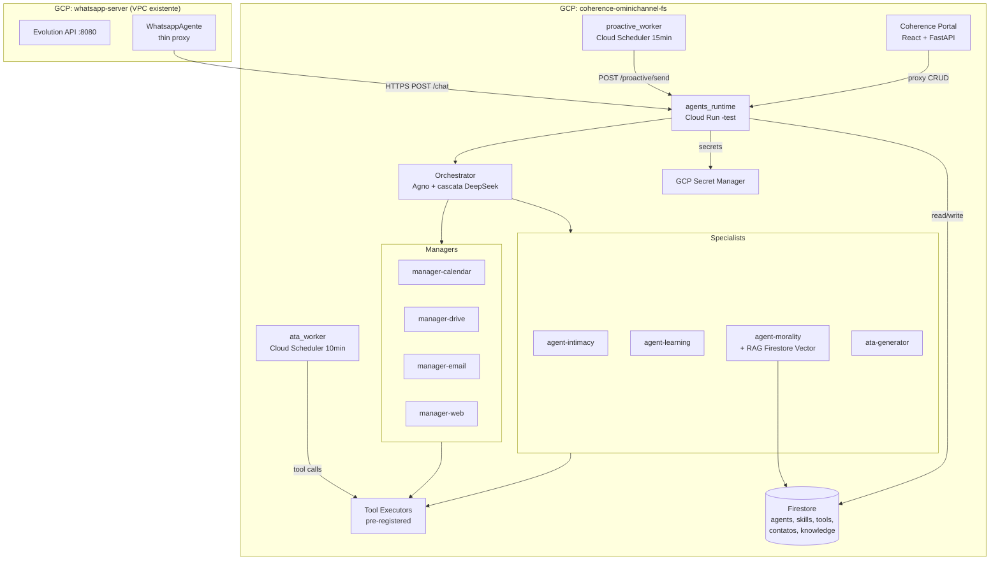
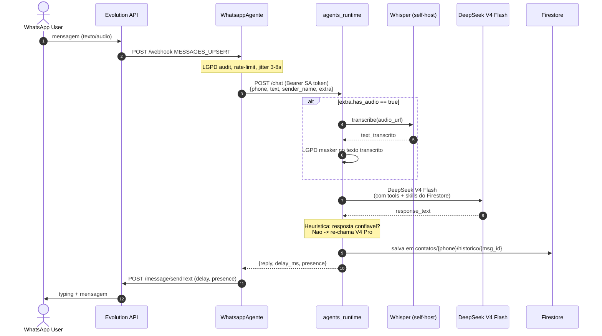

# Plano Consolidado — Omnichannel-Agentes + Jennifer

**Projeto:** Modulo `omnichannel-agentes` no Coherence Portal + servico `agents_runtime` (Cloud Run)
**GCP Project:** `coherence-ominichannel-fs`
**Workspace local:** `C:\Users\vinic\workspace_antigravity\ChatBotWhatsapp\`
**Branch ativa:** `test` (todos os 3 repos)
**Data do plano:** 2026-07-13
**Versao:** 1.0 (primeira entrega, nada em prod ainda)
**Status:** Aguardando liberacao para iniciar Fase 1

---

## 1. Resumo Executivo

Construir o **modulo `omnichannel-agentes`** no Coherence Portal — um runtime de agentes multi-instancia, multi-canal (iniciando em WhatsApp), com **hot-reload de definicoes** via Firestore (zero rebuild), gerenciado por uma hierarquia:

```
jennifier (orchestrator)
    ├── 4 Domain Managers (calendar / drive / email / web)
    └── 3 Specialists (intimacy / learning / morality + ata-generator)
```

**LLM:** DeepSeek V4 Flash (primario) → escalacao automatica → V4 Pro (complexo) → cascata fallback NVIDIA NIM → MiniMax M3.

**Decisoes criticas:**
- Toda gestao de agentes/skills/tools via Portal (sem UI propria em `agents_runtime`)
- Memoria por contato (`contatos/{phone}/historico/{msg_id}`)
- Apelidos com consentimento (dict built-in + aprendizado incremental)
- Auto-aprendizado com confirmacao do usuario no chat
- Proatividade allowlist (`+5511966830020`, real desde dia 1)
- Typing effect: `delay_ms = min(0.6 x palavras x 1000, 15000)`
- Audio self-hosted com Whisper (scale-to-zero)
- RAG vetorial para moralidade (Firestore Vector + embeddings)
- LGPD masker obrigatorio antes de qualquer envio para LLM

---

## 2. Arquitetura

### 2.1 Diagrama Geral



### 2.2 Topologia de Servicos Cloud Run (TEST)

| Servico | URL esperada | Regiao | min/max | CPU | Memory | Auth |
|---|---|---|---|---|---|---|
| `agents-runtime-test` | `agents-runtime-test-xxx-uc.a.run.app` | us-central1 | 0/3 | 2 | 2Gi | Bearer SA token (exceto /healthz) |
| `coherence-portal-test` | `coherence-portal-test-c5nbfc5meq-uc.a.run.app` (existente) | us-central1 | 0/2 | 2 | 2Gi | Firebase JWT |
| `whatsapp-agente-test` | `whatsapp-agente-test-xxx-uc.a.run.app` | us-central1 | **0/2** | 1 | 1Gi | Bearer SA + Evolution webhook + **ping 5min** |

### 2.3 Fluxo de Mensagem WhatsApp (texto + audio)



---

## 3. Decisoes Arquiteturais (Acumuladas)

### 3.1 Modulo e Persona

| Item | Valor |
|---|---|
| Module slug | `omnichannel-agentes` |
| Persona tom | Profissional + humor leve + leve flirt motivacional |
| Hierarchy | jennifier (orchestrator) -> 4 Managers -> Tools + 3 Specialists |
| Multi-instancia | Sim, `instances: []` por agente |
| Playground | Sim, dentro do Portal (`/admin/agents/playground`) |

### 3.2 LLM

| Item | Valor |
|---|---|
| LLM primario | DeepSeek V4 Flash |
| Escalacao | Automatica por heuristica (threshold -2) -> V4 Pro |
| Cascata fallback | DeepSeek -> NVIDIA NIM (V4 Flash) -> MiniMax M3 |
| Thinking mode | Desabilitado por default (opt-in por agente) |
| Cache | Static-first prompts |
| Hot-reload | 120s polling Firestore |

### 3.3 Proatividade

| Item | Valor |
|---|---|
| Allowlist | Env var `PROACTIVE_OWNER_PHONES=+5511966830020` |
| Modo | Enviar real desde dia 1 (sem dry-run) |
| Trigger | Totalmente proativa (eventos Calendar + topicos relevantes diarios) |
| Anti-spam | 9 camadas (allowlist, opt-in, opt-out, max 1/dia, cooldown 4h, quiet hours 20h-8h, anti-ban WhatsApp, throttle por relevancia, dry-run) |
| Kill-switch | Env var `PROACTIVE_DISABLED=true` |
| Allowlist UI | Env var (source of truth) + aba read-only no Portal |

### 3.4 Memoria e Aprendizado

| Item | Valor |
|---|---|
| Storage historico | Subcollection `contatos/{phone}/historico/{msg_id}` |
| Iteracao | Por `phone` (interno), por `preferred_name` (conversa) |
| TTL historico | 90 dias (Cloud Function agendada) |
| Apelidos | Dict built-in (200+ nomes BR) + aprendizado `apelidos_custom/{phone}` |
| Consentimento | Pergunta 1x por conversa: "Posso te chamar de X?" |
| Auto-aprendizado | Agent-learning detecta correcao -> confirma no chat -> aplica |
| LGPD | Masker aplicado ANTES de qualquer envio para LLM |

### 3.5 Audio

| Item | Valor |
|---|---|
| Engine | faster-whisper `base` CPU int8 |
| Onde | Self-hosted no `agents_runtime` |
| Cold start texto | Aceitavel (5-15s na 1a vez do dia, mitigado por ping) |
| Cold start audio | 5-15s (warm, ping ativo) ou 30-60s (cold) |
| Imagem | +500MB (Whisper + CTranslate2 + ffmpeg baked) |
| **Whisper load strategy** | **Background load** (thread paralela apos startup) |
| Cloud Run | `--min-instances=0` (scale-to-zero) + ping 5min |
| Fallback audio | Mensagem amigavel "1o audio demora um pouquinho" |

### 3.6 Moralidade e RAG

| Item | Valor |
|---|---|
| agent-morality | Detecta linguagem grosseira -> recusa educada + info legal |
| RAG storage | Firestore Vector (collection `agente-knowledge-{phone}`) |
| Embeddings | **MiniMax embo-01 (1536d)** via `langchain_community.embeddings.MiniMaxEmbeddings` (incluido no MiniMax Plus) |
| Fontes | Leis BR (codigo penal, assedio moral), sites governamentais, transcricoes YouTube |
| Cache | Documentos relevantes persistidos para reuso |

### 3.7 Typing Effect

| Parametro | Valor |
|---|---|
| Formula | `delay_ms = min(0.6 x word_count x 1000, 15000)` |
| Presence | `composing` |
| Origem | agents_runtime retorna no response; WhatsappAgente usa |

### 3.8 Documentacao

| Item | Valor |
|---|---|
| Estrategia | Atualizar os 4 docs mandatorios incrementalmente por fase |
| Docs | ARQUITETURA, HARNESS, GUARDRAILS, DIARIO_BORDO (+ MODULE_INTEGRATION no Portal) |
| Local | `ChatBotWhatsapp/docs/` e `Coherence_Portal/docs/` |

### 3.9 Testes

| Item | Valor |
|---|---|
| Estrategia | Manual + automatizado (pytest + vitest) a cada fase |
| Politica 5 tentativas | 5 correcoes por ERRO especifico antes de parar e reportar |
| Saida de fase | pytest passando + smoke test manual + log em DIARIO_BORDO |

---

## 4. Agentes (7 total)

### 4.1 jennifier (orchestrator)
- **Role:** orchestrator
- **Model:** `deepseek-v4-flash`
- **Escalation:** `deepseek-v4-pro`
- **Tools:** delega para managers
- **Delegates:** `manager-calendar`, `manager-drive`, `manager-email`, `manager-web`
- **System prompt:** Identidade corporativa OmniChannel, tom motivacional, max 4 linhas

### 4.2 Managers (4)

| Manager | Model | Tools principais |
|---|---|---|
| `manager-calendar` | V4 Flash | calendar.list_events, calendar.create_event, calendar.update_event, calendar.delete_event, calendar.freebusy |
| `manager-drive` | V4 Flash | drive.search_files, drive.upload_file, drive.list_folder, drive.create_folder |
| `manager-email` | V4 Flash | gmail.search_messages, gmail.get_thread, gmail.send_message |
| `manager-web` | V4 Flash | web.search (Serper), web.fetch_url |

### 4.3 Specialists (3 + 1)

| Specialist | Model | Funcao |
|---|---|---|
| `agent-intimacy` | V4 Flash | Gerencia apelidos, primeira impressao, rapport |
| `agent-learning` | V4 Pro (direto, sem escalacao) | Detecta correcao -> confirma -> aplica patch no system_prompt |
| `agent-morality` | V4 Flash | Detecta linguagem grosseira -> recusa educada + RAG para info legal |
| `ata-generator` | V4 Pro + thinking | Gera ata markdown pos-reuniao (acionado por Cloud Scheduler) |

---

## 5. Tool Registry (pre-implementado em Python)

```python
TOOL_REGISTRY = {
    # Google Calendar
    "calendar.list_events": google_calendar.list_events,
    "calendar.create_event": google_calendar.create_event,
    "calendar.update_event": google_calendar.update_event,
    "calendar.delete_event": google_calendar.delete_event,
    "calendar.freebusy": google_calendar.freebusy,
    # Google Drive
    "drive.search_files": google_drive.search_files,
    "drive.upload_file": google_drive.upload_file,
    "drive.list_folder": google_drive.list_folder,
    "drive.create_folder": google_drive.create_folder,
    # Google Gmail
    "gmail.search_messages": gmail.search_messages,
    "gmail.get_thread": gmail.get_thread,
    "gmail.send_message": gmail.send_message,
    # Web
    "web.search": web_search.serper_search,
    "web.fetch_url": web_search.fetch_url,
    # Audio (Whisper self-host)
    "audio.transcribe_ogg_url": audio_transcribe.transcribe_from_url,
    # RAG
    "rag.search_legal_knowledge": rag.search_vector,
    "rag.index_document": rag.index_document,
    # Internal
    "internal.notify_user": notify_whatsapp_user,
    "internal.save_ata": ata_helper.save_to_drive,
}
```

---

## 6. Schema Firestore (consolidado)

### 6.1 `agents/{agent_id}`
```json
{
  "id": "jennifier",
  "name": "Jennifer",
  "role": "orchestrator",
  "parent_id": null,
  "model": "deepseek-v4-flash",
  "model_escalation": "deepseek-v4-pro",
  "escalation_threshold": -2,
  "no_escalation": false,
  "thinking": "disabled",
  "system_prompt": "Voce e a Jennifer, assistente...",
  "skills": ["skill-motivacao-pre-reuniao", "skill-ata-pos-reuniao"],
  "delegates_to": ["manager-calendar", "manager-drive", "manager-email", "manager-web"],
  "tools": [],
  "instances": ["jennifer-omni"],
  "enabled": true,
  "system_prompt_version": 1,
  "last_learned_at": null,
  "created_at": "...",
  "updated_at": "..."
}
```

### 6.2 `skills/{skill_id}`
```json
{
  "id": "skill-motivacao-pre-reuniao",
  "name": "Motivacao pre-reuniao",
  "description": "Tom motivacional para mensagens antes de reunioes",
  "content": "Voce e motivacional. Use 1-2 frases com humor sutil...",
  "enabled": true,
  "updated_at": "..."
}
```

### 6.3 `tools/{tool_id}`
```json
{
  "id": "calendar.list_events",
  "name": "Listar eventos do calendario",
  "description": "Retorna eventos entre duas datas",
  "function_schema": {
    "parameters": {
      "type": "object",
      "properties": {
        "time_min": {"type": "string"},
        "time_max": {"type": "string"},
        "calendar_id": {"type": "string"}
      },
      "required": ["time_min", "time_max"]
    }
  },
  "implementation": "google_calendar",
  "config": {"default_calendar_id": "primary"},
  "enabled": true,
  "updated_at": "..."
}
```

### 6.4 `contatos/{phone}`
```json
{
  "phone": "+5511966830020",
  "display_name": "Vinicius Brito",
  "preferred_name": "Vini",
  "nickname_consent": true,
  "nickname_offered": true,
  "contact_since": "2026-07-13T...",
  "last_contact_at": "2026-07-13T...",
  "proactive_consent": true,
  "proactive_opt_out": false,
  "proactive_eligible": true,
  "proactive_cooldown_until": "...",
  "proactive_messages_today": 0,
  "topics_recentes": ["atas", "Q3 OKRs"],
  "preferences": {
    "formality": "leve",
    "response_length": "curto",
    "best_contact_window": "09:00-18:00"
  },
  "corrections_count": 0
}
```

### 6.5 `contatos/{phone}/historico/{msg_id}`
```json
{
  "ts": "2026-07-13T10:30:00-03:00",
  "direction": "in|out|proactive",
  "text": "...",
  "agent_id": "jennifier",
  "tool_calls": [],
  "tokens_in": 1200,
  "tokens_out": 380,
  "model_used": "deepseek-v4-flash",
  "proactive_context": null
}
```

### 6.6 `contatos/{phone}/corrections/{correction_id}`
```json
{
  "ts": "...",
  "user_quote": "na verdade, meu nome e Vinicius",
  "detected_target": "jennifier.system_prompt",
  "before": "...",
  "after": "...",
  "applied": true,
  "confirmed_at": "..."
}
```

### 6.7 `apelidos_custom/{phone}`
```json
{
  "phone": "+5511966830020",
  "detected_name": "Vinicius",
  "offered_nickname": "Vini",
  "accepted": true,
  "ts": "..."
}
```

### 6.8 `nickname_dict_builtin` (doc estatico)
```json
{
  "Vinicius": ["Vini", "Vinicinho"],
  "Alexandre": ["Xandre", "Alex"],
  "Maria": ["Me", "Mari"],
  "Jose": ["Ze"],
  ... (~200 nomes BR)
}
```

### 6.9 `agente-knowledge-{phone}` (Firestore Vector)
```json
{
  "text_content": "Art. 146-A do Codigo Penal - Assedio moral...",
  "vector_embedding": [0.012, -0.34, ...768d...],
  "embedding_model": "text-embedding-005",
  "embedding_dim": 768,
  "source_title": "Codigo Penal Brasileiro - Art. 146-A",
  "source_url": "https://planalto.gov.br/ccivil_03/decreto-lei/del2848compilado.htm",
  "category": "legislacao_penal",
  "fetched_at": "...",
  "language": "pt"
}
```

### 6.10 `ata_runs/{id}`
```json
{
  "event_id": "evt_123",
  "run_at": "...",
  "status": "completed|failed",
  "drive_file_id": "...",
  "organizer_notified": true,
  "tokens_used": 3500
}
```

---

## 7. Securidade e Auth

### 7.1 agents_runtime Middleware
```python
@app.middleware("http")
async def require_sa_token(request, call_next):
    if request.url.path.startswith("/admin") or request.url.path in ("/chat", "/proactive/send"):
        auth = request.headers.get("Authorization", "")
        if not auth.startswith("Bearer ") or auth[7:] != SA_TOKEN:
            raise HTTPException(403)
    return await call_next(request)
```

### 7.2 Portal como Unica Porta de Entrada Admin
- agents_runtime NAO expoe Swagger publico
- agents_runtime NAO expoe `/docs`, `/redoc`
- Toda escrita admin passa pelo Portal (proxy com Firebase JWT + SA token para agents_runtime)
- Audit trail no Portal (`audit_logs/`)

### 7.3 RBAC no Portal
- `/admin/agents/*` requer super-admin (tier 0)
- Verificado via `isSuperAdmin` em React + `@require_role(min_tier=0)` no backend

---

## 8. Estrutura de Arquivos Final

```
C:\Users\vinic\workspace_antigravity\ChatBotWhatsapp\         # ESTE WORKSPACE
├── docs/                                                      # docs do plano (este arquivo vive aqui)
│   ├── PLAN_OMNICHANNEL_AGENTES.md                           # ESTE DOCUMENTO
│   ├── ARQUITETURA.md                                         # placeholder (atualizado por fase)
│   ├── HARNESS.md
│   ├── GUARDRAILS.md
│   └── DIARIO_BORDO.md
└── agents_runtime/                                            # PROJETO NOVO (Fase 1+)
    ├── main.py
    ├── orchestrator.py
    ├── router.py
    ├── agent_loader.py
    ├── tool_registry.py
    ├── core/
    │   ├── llm_provider.py
    │   ├── escalation.py
    │   ├── masker.py
    │   ├── delay_calculator.py
    │   ├── proactive_gate.py
    │   ├── auth.py
    │   └── rag.py
    ├── tools/
    │   ├── google_calendar.py
    │   ├── google_drive.py
    │   ├── google_gmail.py
    │   ├── web_search.py
    │   ├── nickname.py
    │   ├── correction.py
    │   ├── proactive.py
    │   ├── audio_transcribe.py
    │   └── ata_helper.py
    ├── ata_worker/
    ├── proactive_worker/
    ├── docs/
    ├── tests/
    ├── scripts/
    │   └── upload_secrets.sh
    ├── data/
    │   └── nicknames.json
    ├── requirements.txt
    ├── Dockerfile
    ├── cloudbuild.yaml
    └── .env.runtime.test.yaml

C:\Users\vinic\workspace_antigravity\Coherence_Portal\          # EDICOES
├── frontend/src/pages/agents/                                 # 13 telas novas
├── backend/agents_runtime_proxy.py                           # NOVO
└── backend/main.py                                            # 8 endpoints proxy

C:\Users\vinic\workspace_antigravity\WhatsappAgente\            # EDICOES MINIMAS
└── agente/main.py                                             # thin proxy + POST /send
```

---

## 9. CI/CD Pipeline

### 9.1 Estrategia de Branches
- Branch ativa em todos os 3 repos: `test`
- `main` protegida (sem commits diretos)
- Cloud Build trigger: TODO push em `test` dispara build
- Sem aprovacao manual (primeira versao)

### 9.2 Pipeline por Repo
```
on push to `test`:
  1. LGPD compliance check (script compartilhado)
  2. pytest (backend)
  3. npx vitest run (frontend, Portal only)
  4. docker build + push
  5. gcloud run deploy <service>-test
  6. IAM binding (roles/run.invoker)
```

### 9.3 Secrets (todos no `coherence-ominichannel-fs`)
- `DEEPSEEK_API_KEY` (primario)
- `NVIDIA_API_KEY` (fallback NIM)
- `MINIMAX_API_KEY` (ultimo recurso)
- `SERPER_API_KEY` (web search)
- `GOOGLE_OAUTH_TOKEN_JSON` (Calendar/Drive/Gmail)
- `EVO_API_KEY` (Evolution API)
- `AGENTS_RUNTIME_SA_TOKEN` (Bearer para Portal/WhatsappAgente chamarem)
- `AGENTS_RUNTIME_URL` (URL do servico)

Upload: sempre via `gcloud secrets versions add` (NUNCA edit, devido bug de encoding 12/07/2026).

---

## 10. Faseamento (8 fases)

### Fase 1 — Fundacao
- 5 docs (4 mandatorios + MODULE_INTEGRATION)
- Skeleton FastAPI + llm_provider multi-cascata + masker + escalation + delay_calculator + auth
- Dockerfile + cloudbuild.yaml
- Upload de todos os secrets via `versions add`
- Deploy skeleton `agents-runtime-test`
- Seed `data/nicknames.json`

### Fase 2 — Tool Registry
- tools/google_calendar.py, google_drive.py, google_gmail.py
- tools/web_search.py (Serper)
- tool_registry.py
- Seed das tools no Firestore `tools/`
- Testes de cada tool isoladamente

### Fase 3 — Orchestrator + Audio
- agent_loader.py (poll 120s)
- orchestrator.py (Agno + escalacao)
- router.py (instance -> agent_id)
- tools/audio_transcribe.py (Whisper self-host)
- core/rag.py (Firestore Vector)
- Seed: jennifier + 4 managers + agent-morality + agent-intimacy + agent-learning

### Fase 4 — Portal UI
- 13 telas em `pages/agents/`
- backend/agents_runtime_proxy.py
- 8 endpoints proxy no Portal
- ICON_MAP no Dashboard.jsx ganha `'omnichannel-agentes': Bot`
- Registrar modulo: `POST /api/admin/modules/omnichannel-agentes`
- Atualizar docs/HARNESS.md e docs/MODULE_INTEGRATION.md

### Fase 5 — WhatsappAgente Thin Proxy
- Remover `agente/audio_handler.py` (agora em agents_runtime)
- Ajustar `agent_manager.route()` -> thin proxy para agents_runtime
- Novo endpoint `POST /send` (para proatividade)
- cloudbuild.yaml para whatsapp-agente-test
- Rebuild container

### Fase 6 — Ata Worker
- ata_worker/ (Cloud Run Job)
- cloudScheduler.yaml (a cada 10min)
- Log em `ata_runs/`
- Guard contra duplicatas

### Fase 6.5 — Proactive Worker
- proactive_worker/ (Cloud Run Job)
- cloudScheduler.yaml (15min events + diario 8h topicos)
- Aplica 9 camadas anti-spam
- Allowlist env var `PROACTIVE_OWNER_PHONES=+5511966830020`

### Fase 7 — LGPD & Seguranca
- Validar masker em todos os caminhos
- Audit log LGPD Art. 37 (SHA-256)
- TTL 90d para historico
- Opt-in duplo
- Testes E2E de seguranca

### Fase 8 — Promocao Prod (SOB COMANDO EXPLICITO FUTURO)
- Branch `test` -> `main` via PR
- Cloud Build dispara deploy prod
- Service names sem `-test`
- Secrets com sufixo `-prod`
- Separacao de projeto GCP `coherence-ominichannel-prod`

---

## 11. Protocolo de Execucao por Fase

### 11.1 Sequencia Obrigatoria

1. **Documentar ANTES** nos 4 docs mandatorios + MODULE_INTEGRATION.md (Portal)
   - ARQUITETURA.md: novos componentes + Mermaid
   - HARNESS.md: env vars + deploy + smoke test
   - GUARDRAILS.md: regras inegociaveis descobertas
   - DIARIO_BORDO.md: data BRT + decisao + justificativa

2. **Implementar** codigo (1 commit atomico por feature)

3. **Testar** automatizado (pytest + vitest) + smoke manual (curl/WhatsApp/Portal)

4. **Commit + push em `test`** -> Cloud Build deploy automatico

5. **Reportar** em DIARIO_BORDO.md com resultado

### 11.2 Politica 5 Tentativas
```
Quando aparecer erro:
  Tentativa 1: [abordagem] -> falhou (motivo)
  Tentativa 2: [abordagem] -> falhou (motivo)
  ...
  Tentativa 5: [abordagem] -> falhou (motivo)
  ⛔ PARE - Informar usuario com log + estado + sugestao
```

---

## 12. Custos Estimados

### Cenario real do usuario: ~100 conversas/mes + ~10 proativas + ~5 atas

**Custo mensal final com todas as otimizacoes aplicadas:**

| Componente | USD/mes | BRL/mes |
|---|---|---|
| agents-runtime-test (2Gi, min=0, ping) | $5.00 | R$ 26.50 |
| whatsapp-agente-test (1Gi, min=0, ping) | $3.00 | R$ 15.90 |
| coherence-portal-test (existente) | $5.00 | R$ 26.50 |
| ata-worker (Job) | $1.00 | R$ 5.30 |
| proactive-worker (Job, calibrado) | $0.80 | R$ 4.24 |
| **Cloud Run subtotal** | **$14.80** | **R$ 78.44** |
| LLM (DeepSeek cascata + escalacao + ata) | $0.20 | R$ 1.06 |
| LLM proativo (relevance + generation) | $0.30 | R$ 1.59 |
| Serper (cache 24h, topicos 2x/semana) | $0.50 | R$ 2.65 |
| Audio Whisper (background load) | $0.005 | R$ 0.03 |
| Scheduler + Firestore + Outros | $0.55 | R$ 2.91 |
| **TOTAL** | **~$16.35/mes** | **~R$ 87** |

### Cenarios de escala

| Volume | Custo mensal |
|---|---|
| 50 msgs/mes (super leve) | ~$16 (~R$ 85) |
| 100 msgs/mes (seu cenario) | **~$16.35 (~R$ 87)** |
| 500 msgs/mes (medio) | ~$20 (~R$ 106) |
| 5.000 msgs/mes (intenso) | ~$45 (~R$ 240) |

### Custos NAO incluidos
- Numero WhatsApp (voce ja tem)
- Dominio customizado (voce ja tem `coherenceai.com.br`)

### Premissas das otimizacoes
- agents-runtime: `min-instances=0` + ping Cloud Scheduler 5min
- whatsapp-agente: `min-instances=0` + ping Cloud Scheduler 5min
- Memory 2Gi (lazy load rigoroso de agents)
- Tier 1 (A+B): min-instances=0 + memory 2Gi aplicados
- Tier 2: Serper cache 24h aplicado
- Proactive Worker: INCLUIDO no MVP

---

## 13. Riscos e Mitigacoes

| Risco | Mitigacao |
|---|---|
| LLM em stub mode | CI falha se `DEEPSEEK_API_KEY` vazio |
| OAuth Google expirar | Refresh token + alerta 7d antes |
| Custos Serper estourar | Cache 24h em `web_cache/` Firestore |
| Proatividade vira spammer | **8 camadas anti-spam + kill-switch + allowlist + auto-avaliacao semanal** |
| Proatividade desagradavel | **Calibracao anti-desagrado (2/dia, 5 global, cooldown 12h, templates proibidos)** |
| Cold start texto 5-15s | **Ping Cloud Scheduler 5min** mantem warm |
| Cold start audio 30-60s | Mensagem amigavel + Whisper background load |
| Webhook Evolution timeout durante cold start | **Evolution tem retry 3-5x automatico** — zero perda |
| Learning agent corrompe prompt | Confirmacao obrigatoria no chat + log em `corrections/` |
| Apelido errado ofende | Dict built-in (nunca inventa) + opt-out facil |
| RAG vector DB cresce | Cleanup mensal de docs > 1 ano |
| Bug encoding secrets no SM | Script `upload_secrets.sh` valida UTF-8 + usa `versions add` |
| OOM com 2Gi memory | Lazy load agressivo de agents + cache LRU TTL 30min + teste de stress |
| Engagement baixo proatividade | Auto-pausa 7 dias + log em `proactive_weekly/` |
| LGPD masker esquecer alguma camada | Checklist por fase + testes E2E |

---

## 14. Criterios de Aceite (por fase + global)

### Globais
| Criterio | Metrica |
|---|---|
| Hot-reload funcional | Editar system_prompt no Portal -> resposta nova em <= 2min |
| Zero rebuild para skills | Criar skill no Portal -> visivel em <= 2min |
| Tools toggle | Habilitar/desabilitar no Portal reflete em <= 2min |
| Typing effect | Toda resposta WhatsApp mostra "digitando..." proporcional |
| Apelido com consent | Novo contato "Vinicius" -> pergunta "Vini?" -> apos "sim" usa sempre |
| Correcao registrada | "Nao, meu nome e X" -> confirma -> aplica em <= 2min |
| Proatividade sem spam | Apenas `+5511966830020` + 1 msg/dia + quiet hours |
| Anti-ban | 20 msgs proativas/dia GLOBALMENTE e teto absoluto |
| LGPD | Opt-in + masker + TTL 90d historico |
| Audio | Audio 30s transcrito em <= 5s (warm) / <= 60s (cold) |
| Morality | Linguagem grosseira -> recusa educada + info legal via RAG |

---

## 15. Referencias Internas

- `Coherence_Portal/docs/HARNESS.md` - Setup + module integration
- `Coherence_Portal/docs/MODULE_INTEGRATION.md` - Contrato de registro
- `Coherence_Portal/docs/GUARDRAILS.md` - Regras inegociaveis
- `WhatsappAgente/docs/ARQUITETURA.md` - Pipeline WhatsApp atual
- `Monitoria_Chamadas/docs/ARQUITETURA.md` - Referencia Pub/Sub + Whisper (caso queira fallback)
- Skill `deepseek_model_usage` - Cascata LLM
- Skill `store_to_firestore_vector` / `read_from_firestore_vector` - RAG
- Skill `lgpd_compliance` - Compliance
- Skill `secrets_manager` - Gestao de credenciais
- Skill `coherence_module_integration` - Registro canonico de modulos
- Skill `coherence_cicd_pipeline` - CI/CD patterns

---

## 16. Proximos Passos

**Aguardando comando explicito** para sair do estado de planejamento e iniciar Fase 1.

Quando voce disser "inicie Fase 1" (ou similar), executarei:

1. Criar `ChatBotWhatsapp/agents_runtime/` com 5 docs mandatorios (4 deste workspace + MODULE_INTEGRATION no Portal)
2. Implementar skeleton + llm_provider multi-cascata + masker + escalation + delay_calculator + auth
3. Upload de todos os secrets via `gcloud secrets versions add`
4. Deploy skeleton `agents-runtime-test` no Cloud Run
5. Rodar pytest + smoke test manual (`curl /healthz`)
6. Reportar resultado em `docs/DIARIO_BORDO.md`

---

## 17. Status de Implementacao (2026-07-13)

### Implementado (codigo + testes passando)

| Fase | Status | Detalhes |
|---|---|---|
| Fase 0 - Documentacao | ✅ | 5 docs ChatBotWhatsapp + MODULE_INTEGRATION_AGENTES.md no Portal |
| Fase 1 - Fundacao | ✅ | 48 testes pytest passando |
| Fase 2 - Tool Registry | ✅ | 18 tools (5 calendar, 5 drive, 3 gmail, 2 web, 3 nickname), 39 testes |
| Fase 3 - Orchestrator + Audio + RAG + Groups | ✅ | 44 testes (orchestrator, proactive_gate, correction, agent_loader) |
| Fase 5 - WhatsappAgente thin proxy | ✅ | main.py reescrito + cloudbuild.yaml + 14 testes |
| Fase 6 - Ata Worker | ✅ | Cloud Run Job + 5 testes |
| Fase 6.5 - Proactive Worker | ✅ | Cloud Run Job + 11 testes (calibrado: 2/dia, 5 global, 8 camadas) |
| **TOTAL** | **136 passed, 9 skipped** | pytest em ~3 segundos |

### Pendente (nao implementado)

| Fase | Status | Detalhes |
|---|---|---|
| Fase 4 - Portal UI | ❌ Nao implementado | 13 telas em `Coherence_Portal/frontend/src/pages/agents/` (AgentsLayout, AgentCreate/Review, SkillCreate/Review, ToolCreate/Review, Playground, ContactsList/Detail, ProactiveDashboard, CostDashboard, GroupList/Detail). Backend proxy + 8 endpoints em `Coherence_Portal/backend/`. ~32-40h de trabalho. **Pode ser feito depois** - agents_runtime ja funciona standalone. |
| Fase 7 - LGPD & Seguranca final | ❌ Nao implementado | Validacao extra: TTL 90d historico, opt-out completo, auditoria. **Pode ser feito depois** - masker ja integrado em todos os caminhos. |

### Pendente para DEPLOY (requer GCP)

| Item | Como |
|---|---|
| git init em 3 repos | `cd agents_runtime && git init && git checkout -b test` (mesmo para Portal e WhatsappAgente) |
| git remote add | `git remote add origin <URL>` (precisa URL do seu repo) |
| git push origin test | Dispara Cloud Build automaticamente |
| gcloud secrets create | `./scripts/upload_secrets.sh <name> <value>` (8 secrets) |
| Cloud Scheduler triggers | Manual via console ou gcloud (4 triggers: ata, proactive-events, proactive-topics, group-sync, ping x2) |

### Como usar AGORA (sem deploy)

1. **Local dev com Firestore emulator:**
   ```bash
   firebase emulators:start --only firestore --project coherence-ominichannel-fs
   cd agents_runtime && uvicorn main:app --reload
   ```

2. **Rodar tests:**
   ```bash
   cd agents_runtime && pytest tests/ -q
   # 136 passed, 9 skipped
   ```

3. **Ver logs do que foi feito:**
   ```bash
   cat agents_runtime/docs/DIARIO_BORDO.md
   ```

### Proximos passos sugeridos

1. (Recomendado) Implementar Fase 4 Portal UI quando quiser UI de gestao
2. (Recomendado) git init + push + deploy via Cloud Build para ambiente real
3. (Opcional) Fase 7 validacoes extras de LGPD

---

## 18. Plano Corretivo Priorizado (18/07/2026)

O usuario autorizou execucao sequencial na branch `test`, com bloqueio entre fases: nenhuma fase seguinte inicia antes de documentacao e testes verdes da fase atual.

| Ordem | Fase corretiva | Escopo | Gate |
|---|---|---|---|
| 1 | Fase 3 — Firestore Vector v2 | MiniMax 1536d canonico, collections fixas, `Vector`, `find_nearest`, retencao e reindexacao | Testes RAG + suite completa |
| 2 | Fase 4 — Inventario e orquestracao | Status deterministico, routing seguro, managers internos, identidade Jennifer e estado conversacional | Testes de dialogo + suite completa |
| 3 | Fase 5 — Audio | Audio sem texto, base64 primario, URL controlada e Whisper local | Testes STT + suite completa |

Decisoes vinculantes:

- Nao usar Gemini para inferencia ou transcricao.
- Nao misturar embeddings de providers ou dimensoes diferentes.
- Persistir somente memoria mascarada e aplicar retencao de 90 dias.
- Consultas de status nao chamam todos os LLMs.
- Managers nunca assumem a identidade externa da Jennifer.
- Toda data operacional usa `America/Sao_Paulo`.

### Resultado local na branch test

| Fase | Teste especifico | Suite completa | Status |
|---|---:|---:|---|
| Fase 3 | 16 passed | 168 passed, 9 skipped | Aprovada |
| Fase 4 | 41 passed | 193 passed, 9 skipped | Aprovada |
| Fase 5 | 30 passed | 212 passed, 9 skipped | Aprovada |

Validacoes adicionais concluídas:

- Compilacao Python sem erro.
- YAMLs de env e Cloud Build validos.
- Dry-run RAG: 143 paginas e 192 chunks.
- `ffprobe` e faster-whisper disponiveis localmente.
- Endpoints de status registrados.

Pendencias externas, nao executadas nesta sessao:

1. Criar indices Firestore Vector v2 no projeto GCP de teste.
2. Executar reindexacao real do corpus no ambiente de teste.
3. Buildar a imagem com o modelo Whisper prebaixado.
4. Implantar a branch `test`.
5. Executar smoke tests com audio real, WhatsApp e dashboard.